```{=html}
<style>


.list-group-item.active, .list-group-item.active:focus,
.list-group-item.active:hover{
background-color: pink;
color : red;
border-color: gray;
}

</style>
```

```{r setup, include=FALSE}
knitr::opts_chunk$set(echo = TRUE)
library(tidyverse)
library(data.table)
library(far)
library(MASS)
library(pracma)
library(kableExtra)
library(wooldridge)
library(dplyr)
library(ggplot2)
library(matlib)
library(lubridate)
library(ggplot2)
library(rcompanion)
library(trelliscopejs)
library(knitr)
library(captioner)

options(scipen = 1000)

```

<!-- [1. Abstract](# 1. Abstract) -->

<!-- [2. Introduction](#%20Introduction) -->

<!-- [3. Data](#%20Data) -->

<!-- [4. Methodology](#%20Methodology) -->
<br />
<br />
<br />

#  **1. Abstract**

<br />
<br />


# **2. Introduction**

<br />

## 2.1. Problem Statement  
```{r,include=F}

#* 대도시권역으로 들어올 때는 목적지까지 단일 통행으로 들어오기 어려워서 주로 환승을 함(버스-버스/전철-버스)  

#* 좋은 환승, 즉 환승시간이 짧게 이루어지는 것은 시민들의 대중교통이용을 장려하여 대중교통 이용량 증가  

#* 대도시권의 승용차 이용 정도 감소 효과  

#* 그래서 대중교통 이용승객의 편의성 증대 및 대중교통 이용객 증가 효과  

#* 그런데 대중교통 평균 환승시간(2015년 수도권 기준) 이동 6.3분 대기 7분
```

* When entering a metropolitan area, it is difficult to enter the destination by a single trip, so people usually transfer (bus-bus/train-bus)

* Good transfers, i.e. shorter transfers time, encourage citizens to use public transit, thereby increasing public transportation.

* This could lead to a reduction in the use of automobiles in metropolitan areas.

* In addition, it can increase the convenience of passengers using public transit and escalate the number of passengers using public transit.

* However, based on the Seoul metropolitan area(2015), the average transfers time for public transportation consisted of 6.3 minutes of travel time and 7 minutes of waiting time.

<br />

```{r, echo=FALSE, fig.align='center', out.width="80%", fig.cap="Fig 1. subway and bus"}
 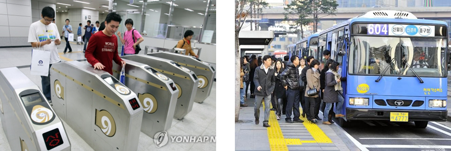
```


<br />

## 2.2. Research Objectives


```{r,include=F}

# * 지하철에서 버스로 환승하는 승객들의 대기시간 감소
# 
# * 대기시간을 계산하기 위해 승객 정류장 도착시각 추정
# 
# * 버스정류장에 도착하는 (bus only user) 승객들의 대기시간 감소도 동시에 고려  
# 
# * 카드 데이터를 통해 얻은 승객의 도착시각 분포에 맞게 버스 운행시간 최적화 목적

```

* To reduce waiting time for passengers transferring from subway to bus

* To Estimate the arrival time at the passenger stop to calculate the waiting time

* Reducing waiting time for bus only users is also considered.

* To optimize bus operation time according to the distribution of arrival time of passengers obtained from card data
 
 
<br /> 

## 2.3. Literature Reviews


* Jansen, Leise Neel, Michael Berliner Pedersen, and Otto Anker Nielsen. "Minimizing passenger transfer times in public transport timetables."(2002)
   * This paper presents a mathematical optimization model that can solve the problem of finding
an optimal timetable for a public transport system in which waiting times connected to
transfers between lines are minimized. 

<br /> 

* Cevallos, Fabian, and Fang Zhao. "Minimizing transfer times in public transit network with genetic algorithm." Transportation Research Record(2006)
   * This paper presents a systemwide approach based on a genetic algorithm for the optimization of bus transit system transfer times.
   
 $$ minimize \sum_{i=1}^{N}\sum_{j=1}^{N}\sum_{k=1}^{D_i}R_k \sum_{l=1}^{D_j}C_{ijkl}\sum_{p=1}^{B_i}\sum_{q=1}^{B_j}[(d_{jlq}+ \Delta_{jlq} + S_j ) - (a_{ikp}+ \Delta_{ikp} + S_j +w_{ijkl})]$$
   

<br />
<br />
<br />


# **3. Data Description**

<br />

```{r,include=F}
#rawData description
midSave <- "C:/Users/TLSYSLAB_3_ADMIN/Desktop/donghoon_temp/2022-1/2022W11-수업-교통및물류최적화(Prof.강)/final/중간save/gimal/"
#rawDataReal <- fread(paste0(Rpath,"0517",".txt"))

#rawforDP <- rawDataReal[1:15,]

rawforDP <- read.csv(file=paste0(midSave,"rawforDP.csv"))

str(rawforDP)

d1 <- c(1:14)
n1 <- c("일련번호","가상카드번호","정산지역코드","카드구분코드","차량ID_국토부표준",
        "차량ID_정산사업자","차량등록번호","운행출발일시","운행종료일시","교통수단코드",
        "노선ID_국토부표준","노선ID_정산사업자","교통사업자ID","승차일시")

d2 <- c(15:28)
n2 <- c("발권시간", "승차정류장ID_국토부표준", "승차정류장ID_교통사업자","하차일시","하차정류장ID_국토부표준",
        "하차정류장ID_정산사업자","트랜잭션ID","환승횟수","사용자구분코드","이용객수_다인승",
        "승차금액","하차금액","총이용거리","총탑승시간")

rawDataCon <- data.frame("No."=d1,"Name"=n1,"No. "=d2,"Name "=n2)
```


<!-- | No. | Name | No. | Name | -->

<!-- |:--:| :---: | :--:| :---: | -->

<!-- |1 | 일련번호 | 15| 발권시간 | -->

<!-- |2 | 가상카드번호 | 16| 승차정류장ID_국토부표준 | -->

<!-- |3 | 정산지역코드 | 17| 승차정류장ID_교통사업자 | -->

<!-- |4 | 카드구분코드 | 18| 하차일시 | -->

<!-- |5 | 차량ID_국토부표준 | 19| 하차정류장ID_국토부표준 | -->

<!-- |6 | 차량ID_정산사업자 | 20 | 하차정류장ID_정산사업자 | -->

<!-- |7 | 차량등록번호  | 21 | 환승횟수 | -->

<!-- |8 | 운행출발일시 | 22 | 사용자구분코드  | -->

<!-- |9 | 운행종료일시 | 23 | 이용객수_다인승 | -->

<!-- |10 | 교통수단코드 | 24 | 승차금액 | -->

<!-- |11 | 노선ID_국토부표준 | 25 | 하차금액 | -->

<!-- |12 | 노선ID_정산사업자 | 26 | 총이용거리  | -->

<!-- |13 | 교통사업자ID | 27 | 총탑승시간 | -->

<!-- |14 | 승차일시 | -->

<br />

## 3.1. Description of Smart Card Data

```{r, echo=F}

kable(rawDataCon,
      align=c("c","c","c","c"),
      caption = "<center><strong>Table 1. Description of Smart Card Data</strong></center>") %>%
   kable_styling(bootstrap_options = "striped", full_width = T, position = "center")%>%
  kable_styling(latex_options = "HOLD_position", font_size=12)

```

<br />

## 3.2. Test Network(120 Line)

```{r, echo=FALSE, fig.align='center', out.width="50%", fig.cap="Fig 2. 120 Line Bus"}
 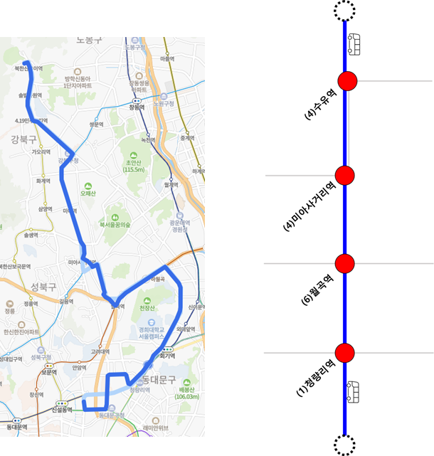
```


```{r, include=F}
# * 서울 강북~청량리를 잇는 버스  
# 
# * 주요 정차역 (지하철역 몇개, 덕성여대, 서울 동부병원 )
# 
# * 2017년 우이신설선이 생기기 전 우이동으로 가는 승객들이 주로 이용
# 
# * 오후 첨두
```

* This Buses is connecting Gangbuk to Cheongnyangni in Seoul.

* Major stops are Cheongnyangni station(Line 1), Suyu Station(Line 4), Duksung Women's University, Seoul Eastern Hospital etc..

* Before the opening of Ui-Sinseol Line, passengers who usually went to Uidong used the bus.

* In this presentation, only the peak hours of the afternoon were analyzed.


<br />

## 3.3. Data Pre-processing


<br />

### 3.3.1. Transfer Passengers

```{r,echo=FALSE}
#환승객 전처리 과정 pseudo code? fig

transfer_example <- read.csv(file=paste0(midSave,"totalTrpChainTable-105000447-0517.csv"))

trnsfr <- transfer_example[1,]

#before chain

r1 <- trnsfr[,c(2,13,4,14,6)]
colnames(r1) <- c("ID","Boarding_Time","Boarding_Station","Alighting_Time","Alighting_Station")
r2 <- trnsfr[,c(2,15,10,16,12)]
colnames(r2) <- c("ID","Boarding_Time","Boarding_Station","Alighting_Time","Alighting_Station")

rr <- rbind(r1,r2)

yorn <- data.frame(c(0,1))
colnames(yorn) <- c("Transfer")

rr <- cbind(rr,yorn)


#after chain

afterChain <- trnsfr[,c(13,4,14,6,15,10,16,12)]
colnames(afterChain) <- c("Boarding_Time1","Boarding_Station1","Alighting_Time1","Alighting_Station1",
                          "Boarding_Time2","Boarding_Station2","Alighting_Time2","Alighting_Station2")


```

```{r, tidy=F, eval=F, highlight=F }
<pseudocode>

Data_Suyu <- filter(Data,Data$BoardingStation == "Suyu" )

ID <- unique(Data_Suyu$ID)

Data_Suyu_candidate <- filter(Data,Data$ID == ID)

Data_Transfer_Available <- filter(Data_Suyu_candidate, $Boarding == B2 & $Alighting == A1)

diff(Data_Transfer_Available$Transfer) == 1
```


```{r, echo=FALSE, fig.align='center', out.width="70%", fig.cap="Fig 3. Transfer Time Zone"}
 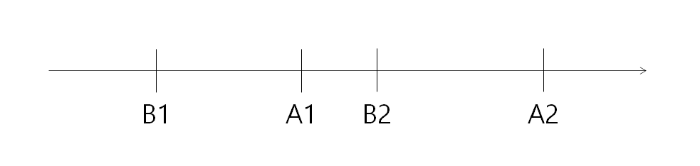
```

<br />

```{r,echo=FALSE}

  
#pick
kable(rr,
      align=c("c","c","c","c","c","c"),
      caption = "<center><strong>Table 2. An example of transfer available passenger</strong></center>") %>%
   kable_styling(bootstrap_options = "striped", full_width = T, position = "center")%>%
  kable_styling(latex_options = "HOLD_position", font_size=12)

kable(afterChain,
      align=c("c","c","c","c","c","c","c","c","c"),
      caption = "<center><strong>Table 3. Trip chain of a transfer available passenger</strong></center>") %>%
   kable_styling(bootstrap_options = "striped", full_width = T, position = "center")%>%
  kable_styling(latex_options = "HOLD_position") %>%
  column_spec (4,border_left = F, border_right = T) %>%
  kable_styling(latex_options = "HOLD_position", font_size=12)


```

<br />

<center><strong>Table 4. Transfer Ratio during the afternoon peak time</strong></center>

| Bus stop NO. | Name | BoardinglSubway |  Boarding | Transder ratio(%) |
| :-----| :-----| :-----| :-----|:-----|
|108000004 | 수유역.강북구청 | 190| 337| 56|
|105000447 | 청량리역환승센터 | 16| 209| 8|
|10700043 | 월곡역 | 71| 208| 34|
|108000012 | 미아사거리역 | 26| 181| 14|


<br />

### 3.3.2. Bus only user

```{r, tidy=FALSE, eval=FALSE, highlight=FALSE }

<pseudocode>
  
Data_Suyu <- filter(Data,Data$BoardingStation == "Suyu" )

BusOnlyUser <- filter(Data_Suyu, Data_Suyu$ID != Data_Transfer_Available$ID)

```

<br />

## 3.4. Assumption


<br />

### 3.4.1. Bus Timetable

```{r, echo=FALSE, fig.align='center', out.width="900%", fig.cap="Fig 4. Framework for estimating passengers arrival time by each transfer type"}
 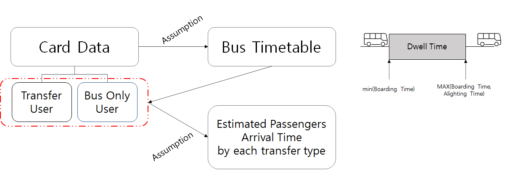
```

<br />

### 3.4.2. Assumption  


```{r, include=F}
#* 버스의 dwell time은 첫 승차부터 마지막 승차, 마지막 하차 중 큰 값을 따른다고 가정한다.

```


* It is supposed that the dwell time of buses follow from the first boarding time to a larger value between the last boarding time and the last alighting time 


<br />


#### i) Transfer User  

* It is presupposed that transfer passengers accompany a specific distribution.
 

* In this presentation, the fixed value is subtracted from the bus tag-in time and assumed to be the arrival time.

```{r, echo=FALSE, fig.align='center', out.width="90%", fig.cap="Fig 5. Distribution of transfers time"}
 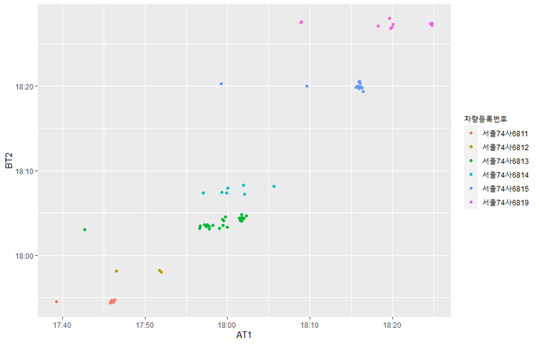
```


<br />

#### ii) Bus Only User  


```{r,include=FALSE}
#* Bus only user는 등간격으로 도착했다고 가정
```

* It is assumed that the bus only users arrived at equal intervals, uniform distribution.


```{r, echo=FALSE, fig.align='center', out.width="60%", fig.cap="Fig 6. Uniform Distribution of bus only users"}
 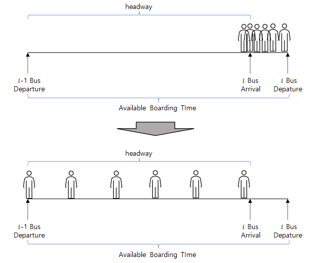
```


<br />

### 3.4.3 Estimating Passenger Arrival Time at the Bus Stop


```{r, echo=FALSE, fig.align='center', out.width="80%", fig.cap="Fig 7. Bus Trajectory by data-driven"}
 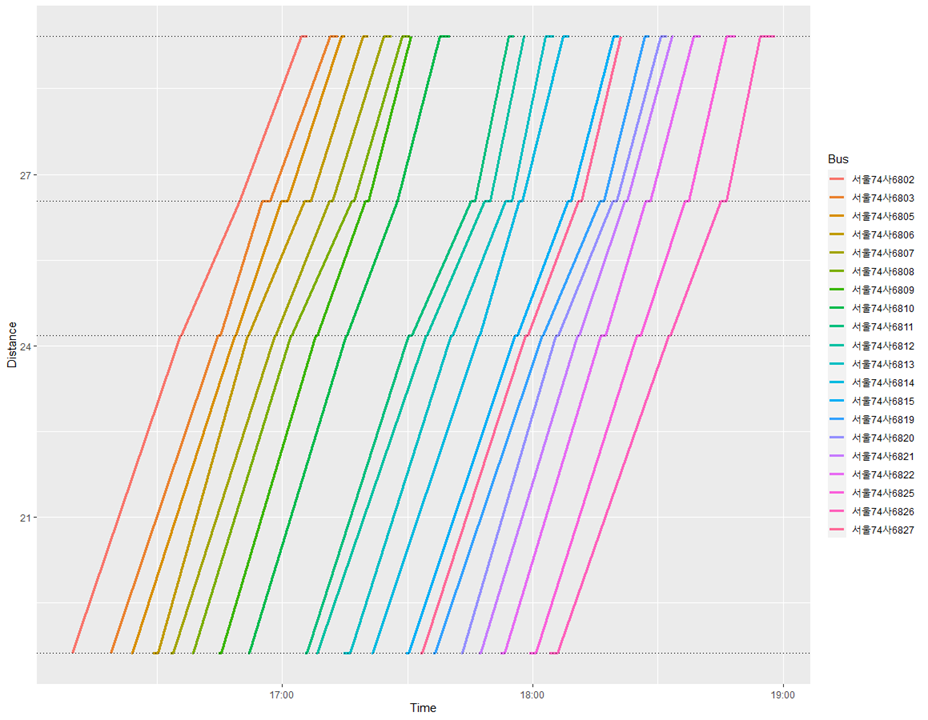
```

<br />

```{r, echo=FALSE, fig.align='center', out.width="40%", fig.cap="Fig 8. Passenger transfer patterns(Leise, et al., 2002)"}
 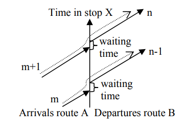
```

<br />

<center><strong>Table 3. Waiting time based on data-driven timetable</strong></center>

| Station | Transfer(min) | Bus Only(min) |
| :-----:| :-----:| :-----:|
|1 | 18.87 | 516.62|
|2 | 79.90 | 488.98|
|3 | 39.37 | 446.15|
|4 | 561.82 | 563.15|
|Sum| 561.82 | 2014.9|

<!-- ## 3.5. Basic Statistics -->

<!-- ```{r} -->
<!-- # facet warp으로 역별 / 환승유형별 누적 도착정도 -->
<!-- ``` -->


<br />
<br />
<br />


# **4. Methodology**

<br />

## 4.1. Genetic Algorithm

```{r, echo=FALSE, fig.align='center', out.width="60%", fig.cap="Fig 9. Genetic Algorithm"}
 knitr::include_graphics("fig/ga.png")
```

* Genetic algorithms are a family of computational models inspired by evolution. These algorithms encode a potential solution to a specific problem on a simple chromosome-like data structure, and apply recombination operators to these structures in such a way as to preserve critical information.

<br />

## 4.2. Chromosome

```{r, echo=FALSE, fig.align='center', out.width="80%", fig.cap="Fig 10. chromosome"}
 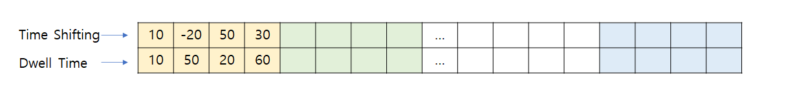
```

* A time shifting gene indicates how fast or slow it will arrive compared to the existing timetable.

* A dwell time gene contains how long it will stop at each bus stop.

<br />

```{r, echo=FALSE, fig.align='center', out.width="80%", fig.cap="Fig 11. reference timetalbe"}
 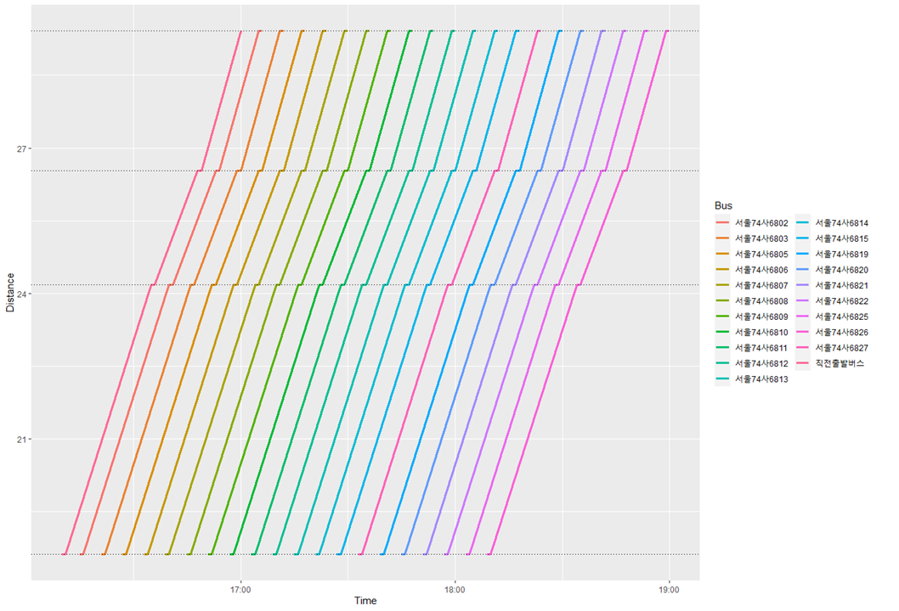
```

<br />

## 4.3. Results

```{r,include=F}
savePath <- "C:/Users/TLSYSLAB_3_ADMIN/Desktop/donghoon_temp/2022-1/2022W11-수업-교통및물류최적화(Prof.강)/final/중간save/fromGA/"

#ordering <- c(0:100)

plotTable <- data.frame()
oderingNum <- data.frame(c(0:100))
for(ordering in c(0:100)){
 
  #ordering <- 0 
  temp <- read.csv(file=paste0(savePath,"/",ordering,"/Fit-gen-",ordering,".csv"))
  
  plotTable <- rbind(plotTable,temp$Fit)
 
  
}
plotTable <- cbind(plotTable, oderingNum)
colnames(plotTable) <- c("Fit","iteration")

```


<left><strong> Fitness Value</strong></left>
```{r,echo=F, fig.cap="Fig 12. Fitness Value"}

ggplot(plotTable, aes(iteration,Fit)) + geom_line(color="red")
```

<br />

```{r, echo=FALSE, fig.align='center', out.width="80%", fig.cap="Fig 13. Fitness Plot: iteration 100"}
 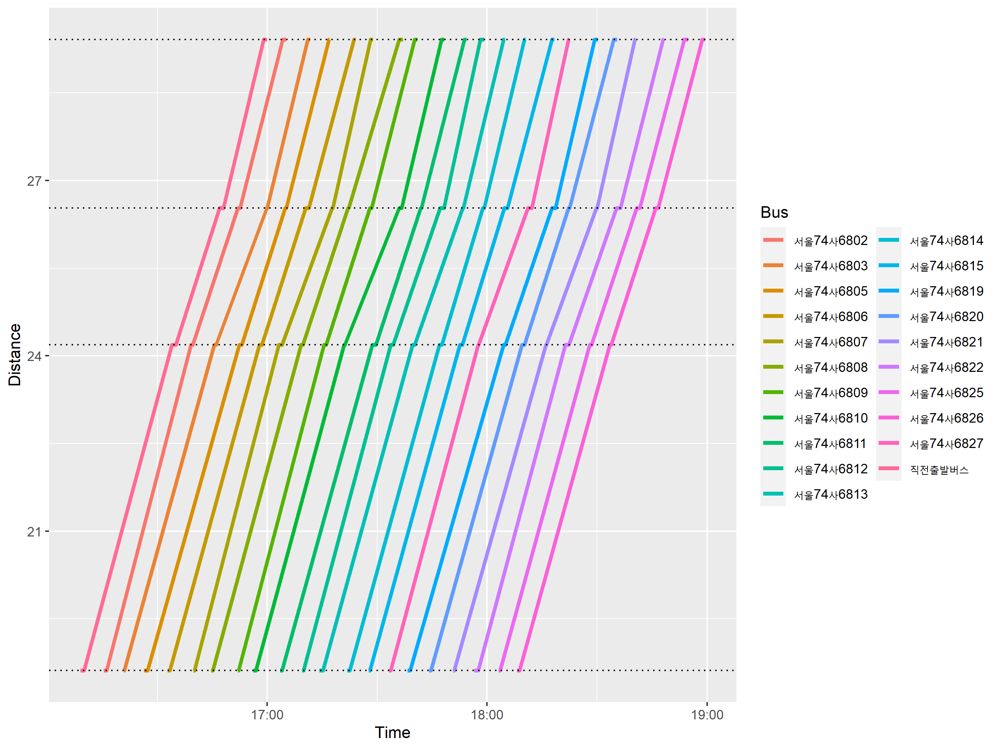
```


<br />
<br />
<br />


# **5. Conclusion**  

<br />

* shifting from the reference timetable seems to be effective, but more realistically, it is necessary to simulate bus movements.

* It is necessary to accurately estimate the distribution of passenger arrivals.


<br />
<br />
<br />


# References

* Jansen, Leise Neel, Michael Berliner Pedersen, and Otto Anker Nielsen. "Minimizing passenger transfer times in public transport timetables." 7th Conference of the Hong Kong Society for Transportation Studies, Transportation in the information age, Hong Kong. 2002.

* Cevallos, Fabian, and Fang Zhao. "Minimizing transfer times in public transit network with genetic algorithm." Transportation Research Record 1971.1 (2006): 74-79.


